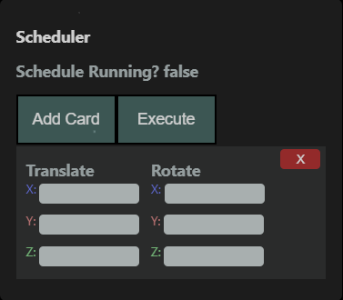

# Cube-Transformations

This repository contains a react app built with three.js for rendering, react-three-fiber, and xstate to store the state of the app. The app allows a user to translate and rotate a cube directly, or make a list of transformations to execute synchronously.

## Dependencies:

You will have to have Node.js installed on your computer, as `npm` will be used to install app dependencies and start the app. If you do not have Node.js installed on your computer, please visit the [Node.js installation page](https://nodejs.org/en/).

## How to install:

Clone this repository to your local machine:

```
git clone git@github.com:devarshp985/Cube-Transformations.git <your root directory name>
```

Navigate to the projects root directory

```
cd <your root directory name>
```

Install the app's dependencies with `npm` by using the `package.json`. Not this should be run from within your root directory.

```
npm i
```

Congratulations! You've installed all the relevant packages to run the app!

## How to run:

To run the app, use `npm` to start the app

```
npm start
```

This command should start an app locally on your machine and start a web browser with the app running inside. The app will be running on the `3000` port on your `localhost` by default.

## Mouse Controls:

When the app is running, left-clicking and dragging on the component viewer will cause the camera to rotate. Right-clicking and dragging will cause the camera to translate in the scene. When the cube moving (current state=inProgress), the camera will be moving alongside it, so you will be able to rotate it, but not translate. The scroll wheel will allow you zoom in (scroll-up) or zoom out (scroll-down) anytime you want.

## Direct Cube Controls:


If this image doesn't appear for you, please take a look at the "DirectControl.png" image in the reamMeimages folder.

On the right side of the browser window, there will be a control pane labelled **Direct Control**. This pane is further split into 4 sections. The first section is the **Translation**. With this pane, you will be able to set a translation in the x, y, and z axes through typing the desired translation amount in their respective fields. Similarly, in the **Rotation** section, you will be able to set the desired rotation amount about the x, y, and z through their respective fields. After filling out the fields with the desired transformation values, hitting the **Execute** button at the top will animate the transformations being applied to the cube. The last two sections named **Current Pose** and **Current State** give the pose of the cube and the state of the app respectively.

Notes:

- Translation value is limited between -100 <> 100, if it was more, you would be going outside the galaxy! (zoom all the way out and you'll see what I mean)
- Rotation value is limited between -180 <> 180 degrees
- the rotation will be counter clockwise about any axis.
- If a value is not specified for any field, it will default to 0

## Scheduler:


If this image doesn't appear for you, please take a look at the "Scheduler.png" image in the reamMeimages folder.

On the left side of the browser window, there will be a control pane labelled **Scheduler**. This pane will allow you to add transformations in an ordered list, and execute them all in order with the press of a button! It will tell you if a schedule is running through the `Schedule Running?` property. To add transformations, hit the **add** button. This will create and add a new card to the bottom of the list of instructions. Feel free to populate the translation and rotation values for each axis whenever you wish, but it should be before you hit the **Execute** button at the top of the pane to run the set of translations! You can also hit the X button on any card to remove it from the schedule and drag the cards around to rearrange!

Notes:

- Translation value is limited between -100 <> 100
- Rotation value is limited between -180 <> 180 degrees
- When the schedule is running (schedule running = true), do not try to use the direct control pane to move the cube
- Although you can, cards should not be edited until the cube is stationary again after hitting the **Execute** button to run the schedule, this will lead to undefined behaviour (for now)
- When a schedule is running, the cards representing each transformation in the list will dissappear when that transformation is completed

## View Behaviour

There are some cool things that I've put in the app. Here's a list:

- The yellow sphere marks the origin (x=0, y=0, z=0)
- When the cube is moving, 3 lines showing the x, y, and z components of the displacement of the cube from the origin will follow the cubes center
- When a new goal position is set (via a transformation being applied on the cube) a light blue sphere will hover at it.
- When a new goal is set, a purple trajectory line will show the path that the cube will traverse through to get to that goal.

### ENJOY!
